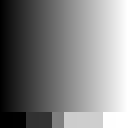

# Tiny-GPU brightness benchmark

Operation: `output = min(255, input + 50)` on unsigned 8-bit grayscale pixels. All four measured runs passed exact pixel comparisons, memory guards, and read/write transaction checks in the RTL testbench.

Source: [benchmark.json](benchmark.json). This report is generated from completed measurements; it contains no estimated benchmark rows.

| Input | Pixels | Launches | Kernel cycles | Simulated kernel time (µs) | Simulator wall time (s) | Correct |
| --- | ---: | ---: | ---: | ---: | ---: | :---: |
| gradient_64.png | 4,096 | 32 | 125,664 | 1,256.640 | 13.255719 | Yes |
| gradient_128.png | 16,384 | 128 | 502,656 | 5,026.560 | 53.818528 | Yes |
| shapes_64.png | 4,096 | 32 | 125,664 | 1,256.640 | 13.570652 | Yes |
| shapes_128.png | 16,384 | 128 | 502,656 | 5,026.560 | 54.088096 | Yes |

## Timing and configuration

Kernel cycles count rising edges from `start` through observed `done`, summed across launches. They exclude reset/configuration setup and host memory transfers. Setup is **5 cycles per launch**, reported separately below.

The **10 ns simulation clock is arbitrary**: simulated kernel time equals `kernel cycles × 10 ns`. The equivalent 100 MHz is an assumption, not a measured or claimed achievable chip frequency.

Simulator wall time measures the driver and RTL execution, including tile preparation, memory service, setup, and correctness checks. It excludes image loading/saving, compilation, and simulator startup. It varies with the host and is not hardware execution time. These measurements do not establish a CPU/GPU speedup.

| Input | Setup cycles (excluded from kernel) | Kernel + setup cycles | Kernel cycles / pixel |
| --- | ---: | ---: | ---: |
| gradient_64.png | 160 | 125,824 | 30.6797 |
| gradient_128.png | 640 | 503,296 | 30.6797 |
| shapes_64.png | 160 | 125,824 | 30.6797 |
| shapes_128.png | 640 | 503,296 | 30.6797 |

Configuration: 2 cores, 4 threads per block, 128 pixels per tile, 4 data-memory channels, 1 program-memory channel, and memory responses after 1 clock cycle. The two cores can execute up to eight pixel threads concurrently; larger images use repeated launches.

Recorded environment: Python 3.9.6; cocotb 1.9.2; Darwin 24.1.0 arm64.

## Scaling from 64 × 64 to 128 × 128

- **Gradient:** 4.00× as many pixels, 4.00× as many launches, 4.0000× as many kernel cycles, and 4.0600× simulator wall time.
- **Shapes:** 4.00× as many pixels, 4.00× as many launches, 4.0000× as many kernel cycles, and 3.9857× simulator wall time.

The fourfold pixel increase requires four times as many complete 128-pixel tiles. Cycle ratios measure the resulting RTL work; wall-time ratios also reflect host execution and verification overhead. This is a size-scaling comparison within the same configuration.

## Before and after

Original synthetic grayscale inputs and their saved RTL outputs; every output uses `k = 50`.

| Input | Before | After |
| --- | --- | --- |
| gradient_64 |  |  |
| gradient_128 |  |  |
| shapes_64 |  |  |
| shapes_128 |  |  |
